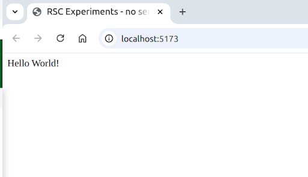
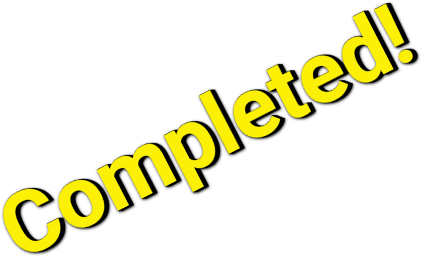
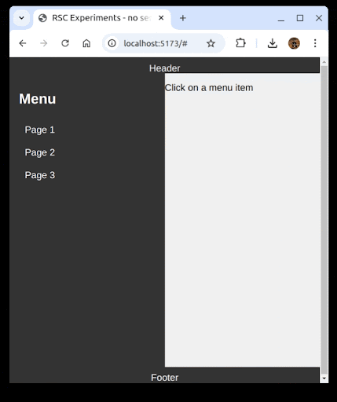
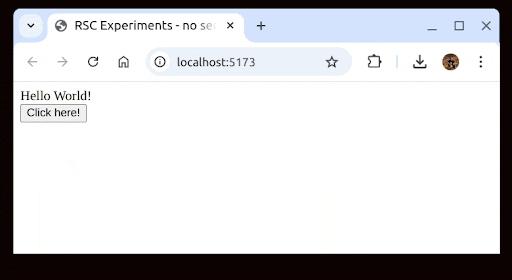
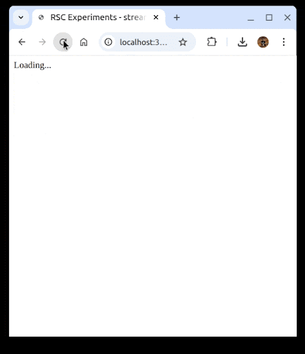
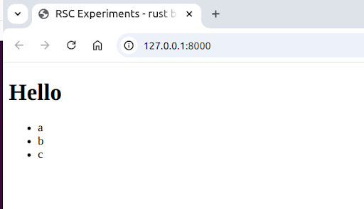
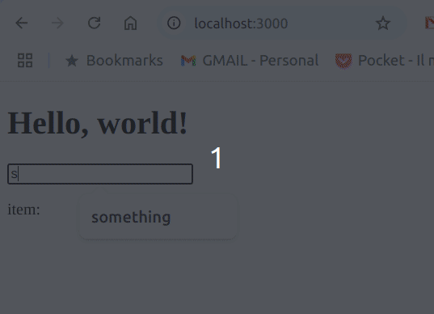
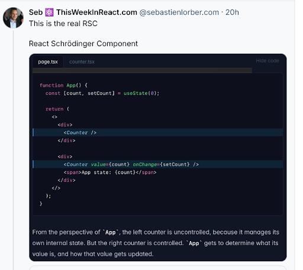

---
# You can also start simply with 'default'
theme: default
# random image from a curated Unsplash collection by Anthony
# like them? see https://unsplash.com/collections/94734566/slidev
# background: https://cover.sli.dev
# some information about your slides (markdown enabled)
title: What does RSC really mean? Only wrong answers
info: |
  ## Slidev Starter Template
  Presentation slides for developers.

  Learn more at [Sli.dev](https://sli.dev)
# apply unocss classes to the current slide
class: text-left
# https://sli.dev/features/drawing
drawings:
  persist: false
# slide transition: https://sli.dev/guide/animations.html#slide-transitions
transition: slide-left
# enable MDC Syntax: https://sli.dev/features/mdc
mdc: true
# take snapshot for each slide in the overview
overviewSnapshots: true
---

<style>
  .slidev-page {
    background-color: #00517c;
  }
</style>

<div class="pt-12">
  
  
  <div class="mx-80 w-140 -my-40 color-white">
    <v-click>In my company, <span font-bold text-green>fridays</span> are dedicated to <span font-bold text-green>exploration</span>.<br/></v-click>
    <v-click>One of those was dedicated to <span font-bold text-green>RSC</span>.<br/></v-click>
    <v-click>The exploration went through a set of <span font-bold text-green>challenges</span>, with the goal of <span font-bold text-green>learning</span> as much as possible.<br/></v-click>
    <v-click>This <span font-bold text-green>talk</span> is about this <span font-bold text-green>learning journey</span>.<br/></v-click>
  </div>
</div>

<!--
-->


---
class: text-center pt-50
---

<style>
h1 {
  color: white;
}
h2 {
  color: #87c25b;
}
hr {
  border: solid 2px #87c25b;
}

</style>

# What does RSC really mean?

<hr class="w-10 ml-100 mb-5"/>

## Only wrong answers

---
class: text-center pt-40 color-white
---

# 1st Challenge

<hr class="w-10 ml-100 mb-5"/>

# React Server(less) Components

<hr class="w-10 ml-100 mt-5 mb-5"/>

## RSC Hello World, without a server!

---

<v-click hide>

</v-click>
<div class="absolute right-10 top-30 w-110 color-white" v-after>
  <h3 class="mb-5">Learnings</h3>
  <span>We can render <span font-bold text-green>pre-generated</span> content by:</span>
  <ul>    
    <li v-click="2"><span font-bold text-green>fetching</span> it</li>
    <li v-click="3">invoking <span font-bold text-green>createFromFetch</span> to decode a <span font-bold text-green>Stream</span> of <span font-bold text-green>binary data</span></li>
    <li v-click="4"><span font-bold text-green>resolving</span> the Stream Promise via the <span font-bold text-green>use</span> hook</li>
    <li v-click="5">rendering the <span font-bold text-green>decoded</span> data as a <span font-bold text-green>React Tree</span></li>
    <div v-click="6">Our content is a <span font-bold text-green>serialized</span> version of JSX, using a new protocol called <span font-bold text-green>React Flight</span>.</div>
  </ul>
</div>

<div class="mt-20 w-100">

```js {*|7|3-8|1,11|14-15,2|7}
import { use } from "react";
import { createRoot } from "react-dom/client";
import { createFromFetch } from 
  "react-server-dom-webpack/client";

const initialContent = createFromFetch(
  fetch("rsc/main.rsc")
);

function Root() {
  return use(initialContent);
}

createRoot(document.getElementById("root"))
  .render(<Root />);

```
</div>

<div class="mt-20 w-100" v-click>

```json
0:["$","div",null,{"children":"Hello World!"}]
```
<arrow x1="150" y1="255" x2="150" y2="480" color="#953" width="2" arrowSize="1" />
</div>

---
class: text-center mt-10
---

```mermaid
%%{
  init: {
    'themeVariables': {
      'lineColor': '#AAA'
    }
  }
}%%
flowchart TD
  A@{shape: circle, label: "JSX"}
  B@{img: "./rsc_payload_1.png", w: 350, constraint: "on"}
  A -- Serialize (???) --> B
  B -- Deserialize (createFromFetch) --> HTML[&lt;div&gt;Hello World!&lt;/div&gt;]
```

---
class: text-center pt-40 color-white
---



# 1st Challenge

<hr class="w-10 ml-100 mb-5"/>

# React Server(less) Components

<hr class="w-10 ml-100 mt-5 mb-5"/>

## RSC Hello World, without a server!

---
class: text-center pt-40 color-white
---

# 1st Challenge (and 1/2)

<hr class="w-10 ml-100 mb-5"/>

# Replaceable Static Content

<hr class="w-10 ml-100 mt-5 mb-5"/>

## Multi page website

---

<v-click hide>

</v-click>
<div class="absolute right-10 w-90 color-white" v-after>
  <h3 class="mb-5">Learnings</h3>
  <span>We can <span font-bold text-green>switch</span> content by:</span>
  <ul>    
    <li v-click="2"><span font-bold text-green>storing</span> content into React <span font-bold text-green>state</span></li>
    <li v-click="3"><span font-bold text-green>updating</span> state as we fetch <span font-bold text-green>new content</span></li>
    <li v-click="4"><span font-bold text-green>passing</span> content as properties to a dynamic <span font-bold text-green>component</span></li>
  </ul>
  <span v-click="5">React Flight is a rich protocol, it supports:</span>
  <ul>    
    <li v-click="6">React Trees (<span font-bold text-green>$</span>)</li>
    <li v-click="7">many <span font-bold text-green>chunks</span>, identified by <span font-bold text-green>keys</span> (1, 2, 3, 0)</li>
    <li v-click="8"><span font-bold text-green>composition</span> via <span font-bold text-green>references</span> to other chunks (<span font-bold text-green>$2</span>, <span font-bold text-green>$3</span>)</li>
  </ul>
  
</div>

<div class="w-120">
````md magic-move {lines: false}
```js {*|4|6-10|1}
function Root({ content }) => use(content);

function Layout() {
  const [page, setPage] = useState(null);

  function loadPage(page) {
    setPage(
      createFromFetch(fetch(`rsc/page${page}.rsc`))
    );
  }

  return (
    <>
      <menu>
        <li>
          <a href="#" onClick={() => loadPage(1)}>Page 1</a>
        </li>
      </menu>
      <Root content={page} />
    </>
  );
}
createRoot(document.getElementById("root")).render(<Layout />);

```
```json {*|3|*}
2:["$","h1",null,{"children":"Title"},"$1"]
3:["$","p",null,{"children":"Page1"},"$1"]
0:["$","div",null,{"children":["$2","$3"]},"$1"]
```
```json {1,2,4}
2:["$","h1",null,{"children":"Title"},"$1"]
3:["$","p",null,{"children":"Page1"},"$1"]
0:["$","div",null,{"children":[
  "$2","$3"
]},"$1"]
```
````
</div>

---
layout: two-cols-header
class: text-center
---

<style>
  .col-header {
    font-size: 32px;
    color: white;
  }
</style>

<div class="text-center">What can we do with our learnings?</div>

::left::

# SSG

## Static Site Generation

::right::

<ul class="color-white text-left">    
    <li>Why not using <span font-bold text-green>HTML?</span></li>
    <li v-click>Flight is more expressive (<span font-bold text-green>data</span>, <span font-bold text-green>delayed content</span>, etc.)</li>
    <li v-click>Use it if you need its <span font-bold text-green>richness</span></li>
</ul>

---
class: text-center pt-40 color-white
---


# 1st Challenge (and 1/2)

<hr class="w-10 ml-100 mb-5"/>

# Replaceable Static Content

<hr class="w-10 ml-100 mt-5 mb-5"/>

## Multi page website

---
class: text-center pt-40 color-white
---

# 2nd Challenge

<hr class="w-10 ml-100 mb-5"/>

# React Server<small>(and)</small>Client

<hr class="w-10 ml-100 mt-5 mb-5"/>

## Split rendering between a server and a client

---


<div class="absolute right-10 w-90 color-white -mt-5">
  <h3 class="mb-5">Learnings</h3>
  <span>We need a <span font-bold text-green>condition</span> on the starting script to enable react in <span font-bold text-green>server mode</span><br/></span>
  <span v-click="1">We can <span font-bold text-green>pre-generate</span> content on the <span font-bold text-green>backend</span> by:</span>
  <ul>    
    <li v-click="2">invoking <span font-bold text-green>renderToPipeableStream</span> to <span font-bold text-green>serialize</span> a (server) component (on a dedicated endpoint)</li>
    <li v-click="3"><span font-bold text-green>streaming</span> the result on the <span font-bold text-green>response</span></li>
  </ul>
  <span v-click="4">React Flight includes:</span>
  <ul>    
    <li v-click="5">Server components description</li>
    <li v-click="6">The generated DOM with references to the hosting component</li>
  </ul>
  
</div>

<div class="w-120 mt-10">
```sh
node --conditions=react-server server.js
```
</div>

<div class="w-120" v-click="1">
```js {*|*|2-3,13|14|*}
import Fastify from "fastify";
import { renderToPipeableStream } 
  from "react-server-dom-webpack/server";

function App() => <div>Hello world!</div>;

export async function main() {
  const server = Fastify();

  server.get("/", (_, reply) => reply.html();

  server.get("/rsc", (_, reply) => {
    const { pipe } = renderToPipeableStream(<App/>);
    pipe(reply.raw);
  });

  return server;
}

const server = await main();
await server.listen({ port: 3000 });
```
</div>

<div class="w-100 absolute bottom-5 right-5" v-click="4">
```json {*|1|2-4}
1:{"name":"App","env":"Server","owner":null}
0:["$","div",null,{"children":"Hello World!"},
  "$1"
]
```
</div>

---
class: text-center mt-10
---

```mermaid {markdownAutoWrap: false}
flowchart TD
  A@{shape: circle, label: "JSX"}
  B@{img: "./rsc_payload_1.png", w: 350, constraint: "on"}
  A -- Serialize (renderToPipeableStream) --> B
  B -- Deserialize (createFromFetch) --> HTML[&lt;div&gt;Hello World!&lt;/div&gt;]
```
---
class: color-white op-100
---

### So we moved all rendering to the backend, but...

<div class="mt-40">
  <span v-click="1">Server components are, by design, <span font-bold text-green>stateless</span>:</span>
  <ul>    
    <li v-click="2">can't use hooks to manage <span font-bold text-green>state</span></li>
    <li v-click="3">can't use <span font-bold text-green>context</span> either</li>
  </ul>
  <span v-click="4">Moreover, we miss <span font-bold text-green>interactive components</span></span>
</div>
---

<v-click hide>

</v-click>

<div class="absolute right-10 w-90 color-white" v-after>
  <h3 class="mb-5">Learnings</h3>
  <span>RSC introduces <span font-bold text-green>client (only) components</span>:</span>
  <ul>    
    <li v-click="2">you must prefix them with the directive <span font-bold text-green>use client</span></li>
    <li v-click="3">we can nest them <span font-bold text-green>in server components</span>, not the other way around</li>
  </ul>
  <span v-click="4">Client components are <span font-bold text-green>serialized</span> into:</span>
  <ul>
    <li v-click="5">an <span font-bold text-green>import</span> chunk (<span font-bold text-green>I</span>).</li>
    <li v-click="6">one ore more <span font-bold text-green>lazy references</span> (<span font-bold text-green>$La</span>)</li>
  </ul>
</div>

<div class="w-120">
```js {*|1}
"use client";

export const MyClientComponent = ({ content }) =>
  <button onClick={() => alert("Clicked!")}>
     {content}
  </button>;
```
</div>

<div class="w-120">
```js {*|1-3,6}
import { MyClientComponent } 
  from "./client/my-client-component.js"

function App() => (<div>
  <h1>Hello world!</h1>
  <MyClientComponent content="Click me!"/>
</div>);

export async function main() {
  ...
  server.get("/rsc", (_, reply) => {
    const basePath = new URL("./client",import.meta.url).href;
    const { pipe } = renderToPipeableStream(<App/>, , {
      [`${basePath}/my-client-component.js#MyClientComponent`]: {
        ...
      }
    });
    pipe(reply.raw);
  });
  return server;
}
```
</div>

<div class="absolute w-100 bottom-15 right-5" v-click="4">
```json {*|*|1|4}
a:I["/my-client-component.js","MyClientComponent"]
0:["$","div",null,{"children":[
  ["$", "div", null, {"children": "Hello World!"}], 
  ["$", "$La", "a", {"content": "Click here!"}]]}
]
```
</div>
---
class: color-white op-100
---

# Additional notes

<div class="color-white -mt-3">A custom loader (or a bundler),  is needed on the backend to handle client components</div>

<div class>
```sh
node --import ./register-rsc-loader.js server.js
```
```js
import { load as reactLoad } from "react-server-dom-webpack/node-loader";

async function textLoad(url, context, defaultLoad) {
  const result = await defaultLoad(url, context, defaultLoad);
  if (result.format === "module") {
    return {
      source: Buffer.from(result.source).toString("utf8"),
      format: "module",
    };
  }
  return result;
}

export async function load(url, context, defaultLoad) {
  const result = await reactLoad(url, context, (u, c) => {
    return textLoad(u, c, defaultLoad);
  });
  return result;
}

```
</div>

---
layout: two-cols-header
class: text-center
---
<style>
  .col-header {
    font-size: 32px;
    color: white;
  }
</style>

<div class="text-center">What can we do with our learnings?</div>

::left::

# SSR

## Server Side Rendering

::right::

<ul class="color-white text-left">    
    <li><span font-bold text-green>renderToString</span> --> HTML</li>
    <li v-click><span font-bold text-green>renderToPipeableStream</span> --> React Flight payload</li>
    <li v-click>I still miss the <span font-bold text-green>killer feature</span>.</li>
</ul>

---
class: text-center pt-40 color-white
---


# 2nd Challenge

<hr class="w-10 ml-100 mb-5"/>

# React Server<small>(and)</small>Client

<hr class="w-10 ml-100 mt-5 mb-5"/>

## Split rendering between a server and a client

---
class: text-center pt-40 color-white
---

# 3rd Challenge

<hr class="w-10 ml-100 mb-5"/>

# React Streaming Components

<hr class="w-10 ml-100 mt-5 mb-5"/>

## Streaming (infinite) content with RSC!

---

<v-click hide>

</v-click>

<div  v-click.hide="5">
  <div class="absolute right-10 w-90 color-white" v-after>
    <h3 class="mb-5">Learnings</h3>
    <span>We can <span font-bold text-green>stream content</span> indefinitely by:</span>
    <ul>    
      <li v-click="2">using <span font-bold text-green>async / await</span> to get content in the <span font-bold text-green>background</span></li>
      <li v-click="3">using <span font-bold text-green>Suspense</span> to wait for <span font-bold text-green>async content</span> with a <span font-bold text-green>fallback</span>.</li>
      <li v-click="4">using <span font-bold text-green>recursion</span> to create a (potentially) <span font-bold text-green>infinite</span> content stream</li>
    </ul>
  </div>
</div>

<div class="absolute right-10 w-90 color-white" v-click="5">
  <h3 class="mb-5">Learnings</h3>
  <span>React Flight is able to serialize this by:</span>
  <ul>    
    <li v-click="6">allowing serialization of React <span font-bold text-green>internal components</span> (e.g. Suspense) through <span font-bold text-green>symbols</span> (<span font-bold text-green>$S</span>react.suspense)</li>
    <li v-click="7">referencing future content as <span font-bold text-green>lazy content</span> (<span font-bold text-green>$L3</span>)</li>
    <li v-click="8">streaming content in <span font-bold text-green>chunks</span>, as it is available</li>
  </ul>
</div>

<div class="w-120">
```js {*|1-2|4-5|6,14}
async function Async({ counter }) {
  await new Promise((r) => setTimeout(r, 1000));
  return (<>
    <p>Counter: {counter}</p>
    <Suspense fallback="Loading...">
      <Async counter={counter + 1}/>
    </Suspense>
  </>);
}

function App() {
  return (<div>
    <Suspense fallback="Loading...">
      <Async counter={0}/>
    </Suspense>
  </div>);
}

```
</div>


<div class="absolute w-220 bottom-10 left-10" v-click="5">
````md magic-move {lines: false}
```json {*|*|1|3}
2:"$Sreact.suspense"
0:["$","div",null,{"children":["$","$2",null,{"fallback":"Loading...","children":
  "$L3"
},"$1"]},"$1"]
```
```json {3,5}
2:"$Sreact.suspense"
0:["$","div",null,{"children":["$","$2",null,{"fallback":"Loading...","children":
  "$L3"
},"$1"]},"$1"]
3:[["$","p",null,{"children":"Counter: 0"},null],["$","$2",null,{"fallback":"Loading...","children": "$L5"},null]]
```
````
</div>

---
layout: two-cols-header
class: text-center
---
<style>
  .col-header {
    font-size: 32px;
    color: white;
  }
</style>

<div class="text-center">What can we do with our learnings?</div>

::left::

# Streaming Content

## Fast and Slow Content

::right::

<ul class="color-white text-left">    
    <li><span font-bold text-green>HTML</span> does not (easily) support streaming content</li>
    <li v-click>This is a real <span font-bold text-green>game changer!</span></li>
</ul>

---
class: text-center pt-40 color-white
---


# 3rd Challenge

<hr class="w-10 ml-100 mb-5"/>

# React Streaming Components

<hr class="w-10 ml-100 mt-5 mb-5"/>

## Streaming (infinite) content with RSC!

---
class: text-center pt-40 color-white
---

# 4th Challenge

<hr class="w-10 ml-100 mb-5"/>

# React Strange Constraints

<hr class="w-10 ml-100 mt-5 mb-5"/>

## Generating both HTML and Flight with RSC!

---

<div class="absolute right-10 w-90 top-15 color-white">
  <h3 class="mb-5">Learnings</h3>
  <span>We can have a <span font-bold text-green>dedicated</span> backend for <span font-bold text-green>rsc</span> generation:</span>
  <ul>    
    <li v-click="1">started with the react-server <span font-bold text-green>conditions</span> flag</li>
    <li v-click="2">with an rsc endpoint using <span font-bold text-green>renderToPipeableStream</span></li>
    <li v-click="3">on a <span font-bold text-green>different port or server</span> than the main backend</li>
  </ul>
  <span v-click="4">The RSC endpoint can be also hosted on the main backend, using <span font-bold text-green>workers</span> (an example is in the talk repository)</span>
</div>


<div class="w-120 absolute top-30">
```sh
node --conditions=react-server rsc.js

```
</div>

<div class="w-120 absolute top-40">
```js {none|none|4-8|14}
export async function main() {
  const server = Fastify();

  server.get("/rsc", (req, reply) => {
   const page = Number(req.query.page);
   const {pipe} = renderToPipeableStream(<Page page={page}/>);
   pipe(reply.raw);
  });

  return server;
}

const server = await main();
await server.listen({ port: 4000 });

```
</div>

---

<div class="absolute right-10 w-90 top-35 color-white">
  <h3 class="mb-5">Learnings</h3>
  <span>The <span font-bold text-green>main</span> backend will:</span>
  <ul>    
    <li v-click="1">offer a <span font-bold text-green>pass-through</span> /rsc endpoint to <span font-bold text-green>delegate</span> to the rsc backend</li>
    <li v-click="2">pregenerate static HTML using <span font-bold text-green>prerender</span></li>
    <li v-click="3">include also the initial <span font-bold text-green>RSC payload</span> for <span font-bold text-green>hydration</span></li>
  </ul>
</div>


<div class="w-120 -mt-5">
```js {*|3-13|1,17|3-8,11,22-24}
import { prerender } from "react-dom/static.edge";

async function fetchRsc(req, page) {
  const rscResponse = await fetch(
    `http://localhost:4000/rsc?page=${page}`
  );
  return await rscResponse.text();
}

server.get("/rsc", async (req, reply) => {
  const rscContent = await fetchRsc(req, req.query.page);
  reply.send(rscContent);
});

server.get("/", async (req, reply) => {
  const rscContent = await fetchRsc(req, 0);
  let page = await prerender(<App page={0}/>);
  const html = `<!doctype html>
<html lang="en">
<body>
  <div id="root">${page}</div>
    <script id="initial-rsc" type="text/plain">
      ${rscContent}
    </script>
  </body></html>`;
  return reply.type("text/html").send(html);
});

await server.listen({ port: 3000 });
```
</div>
---

<div class="absolute right-10 w-90 top-35 color-white">
  <h3 class="mb-5">Learnings</h3>
  <span>On the client we can <span font-bold text-green>hydrate</span> content by:</span>
  <ul>    
    <li v-click="1">getting the <span font-bold text-green>RSC payload</span> already included in the page</li>
    <li v-click="2">transforming the payload into a stream through a <span font-bold text-green>ReadableStream</span></li>
    <li v-click="3">using <span font-bold text-green>createFromReadableStream</span> to <span font-bold text-green>deserialize</span> it</li>
  </ul>
</div>


<div class="w-120 mt-15">
```js {*|4-5|8-10|12}
function Layout() {
  const [pagePromise, setPagePromise] = useState(null);

  const initialRsc = document.getElementById("initial-rsc")
    .innerText;

  useEffect(() => {
    const stream = new ReadableStream({
      ...
    });

    const initialContent = createFromReadableStream(stream);
    setPagePromise(initialContent);
  }, []);

  ...
}

createRoot(document.getElementById("root")).render(<Layout/>);
```
</div>

---
layout: two-cols-header
class: text-center
---
<style>
  .col-header {
    font-size: 32px;
    color: white;
  }
</style>

<div class="text-center">What can we do with our learnings?</div>

::left::

# Optimize initial page loading


## Prerender HTML and initial RSC

::right::

<ul class="color-white text-left">    
    <li>This makes RSC able to work as the <span font-bold text-green>classic SSR</span> was</li>
    <li v-click>Why can't we use <span font-bold text-green>renderToPipableStream</span> and <span font-bold text-green>prerender</span> in the <span font-bold text-green>same thread</span>? This remains a <span font-bold text-green>mystery</span> to me</li>
</ul>

---
class: text-center pt-40 color-white
---


# 4th Challenge

<hr class="w-10 ml-100 mb-5"/>

# React Strange Constraints

<hr class="w-10 ml-100 mt-5 mb-5"/>

## Generating both HTML and Flight

---
class: text-center pt-40 color-white
---

# 5th Challenge

<hr class="w-10 ml-100 mb-5"/>

# Rust Server Components

<hr class="w-10 ml-100 mt-5 mb-5"/>

## Using a language, other than JS, in the backend

---

<v-click hide>

</v-click>

<div class="absolute right-10 w-90 top-25 color-white" v-after>
  <h3 class="mb-5">Learnings</h3>
  <span>We can create server components in <span font-bold text-green>Rust</span> by:</span>
  <ul>    
    <li v-click="2">using the <span font-bold text-green>rscx</span> library</li>
    <li v-click="3">tagging a <span font-bold text-green>function</span> as a <span font-bold text-green>component</span> using the <span font-bold text-green>#component</span> attribute</li>
    <li v-click="4">defining a component output in a <span font-bold text-green>jsx-like</span> syntax, via the <span font-bold text-green>html!</span> macro</li>
    <li v-click="5">using the <span font-bold text-green>flight</span> function (just a proof of concept) to <span font-bold text-green>serialize</span> the output as a <span font-bold text-green>React Flight payload</span>, instead of HTML</li>
  </ul>
</div>


<div class="w-120 -mt-5">
```rust {*|3|14-25|19-24|7-11}
mod app {
    use flight::flight;
    use rscx::{component, html, props, CollectFragment};

    #[rocket::get("/rsc")]
    pub async fn rsc() -> String {
        flight(html! {
            <Section title="Hello">
                <Items />
            </Section>
        })
    }

    #[component]
    fn Section(
        title: String,
        children: String,
    ) -> String {
        html! {
            <div>
                <h1>{ title }</h1>
                { children }
            </div>
        }
    }
}
```
</div>

---
layout: two-cols-header
class: text-center
---
<style>
  .col-header {
    font-size: 32px;
    color: white;
  }
</style>

<div class="text-center">What can we do with our learnings?</div>

::left::

# Language Agnostic Protocol

## Extended Usage

::right::

<ul class="color-white text-left">    
    <li><span font-bold text-green>Not</span> an <span font-bold text-green>easy</span> target</li>
    <li v-click>We at least need a <span font-bold text-green>documented</span> and <span font-bold text-green>stable</span> specification for React Flight</li>
    <li v-click>An <span font-bold text-green>option</span> to consider!</li>
</ul>

---
class: text-center pt-40 color-white
---


# 5th Challenge

<hr class="w-10 ml-100 mb-5"/>

# Rust Server Components

<hr class="w-10 ml-100 mt-5 mb-5"/>

## Using a language, other than JS, in the backend

---
class: text-center pt-40 color-white
---

# 6th Challenge

<hr class="w-10 ml-100 mb-5"/>

# Remote Server Call

<hr class="w-10 ml-100 mt-5 mb-5"/>

## Remote procedure calls in React sauce

---

<v-click hide>

</v-click>

<div class="absolute right-10 w-90 top-25 color-white" v-after>
  <h3 class="mb-5">Learnings</h3>
  <span>We can create <span font-bold text-green>server functions</span> by:</span>
  <ul>    
    <li v-click="2">using the <span font-bold text-green>use server</span> directive</li>
    <li v-click="3">declaring an <span font-bold text-green>async function</span></li>
    <li v-click="4">declaring a <span font-bold text-green>post endpoint</span> to handle the server functions</li>
    <li v-click="5">properly calling the <span font-bold text-green>action handler</span></li>
    <li v-click="6">returning the <span font-bold text-green>action result</span> as an RSC payload</li>
  </ul>
</div>


<div class="w-120 mt-10">
```js {*|1|3-6|8|9-12|13-14|*}
"use server";

export async function fun() {
  await new Promise((resolve) => setTimeout(resolve, 1000));
  return { status: "success", message: "Hello World!" };
}

server.post("/functions", async (req, reply) => {
    const serverReference = req.headers["rsc-function"];
    const [filepath, name] = serverReference.split("#");
    const fun = (await import(filepath))[name];
    const result = await fun();
    const { pipe } = renderToPipeableStream(result);
    pipe(reply.raw);
});

```
</div>

---

<div class="absolute right-10 w-90 top-25 color-white">
  <h3 class="mb-5">Learnings</h3>
  <span>We can call <span font-bold text-green>server actions</span> from client code by:</span>
  <ul>    
    <li v-click="1">defining an async function to <span font-bold text-green>call server action(s)</span> and registering it in createFromFetch</li>
    <li v-click="2">calling the <span font-bold text-green>server endpoint</span> and using <span font-bold text-green>createFromFetch</span> on the result</li>
  </ul>
</div>


<div class="w-120 mt-20">
```js {*|1,11|2-8|*}
async function callServer(id, args) {
  const fetchPromise = fetch(`/functions`, {
    method: "POST",
    headers: { "rsc-function": id },
    body: await encodeReply(args),
  });
  const actionResponsePromise = createFromFetch(fetchPromise);
  return = await actionResponsePromise;
}

const initialContentPromise = createFromFetch(...,{callServer});

```
</div>


---

<div class="absolute right-10 w-100 top-5 color-white">
  <h3 class="mb-5">Learnings</h3>
  <span>We can <span font-bold text-green>connect</span> client and server by:</span>
  <ul>    
    <li v-click="1">getting the <span font-bold text-green>server function</span> reference from a <span font-bold text-green>client component</span></li>
    <li v-click="2">calling the function from <span font-bold text-green>an effect</span> and storing the result</li>
    <li v-click="3">properly using the client component and connecting it with the <span font-bold text-green>server function</span></li>
  </ul>
  <span v-click="4">The flight payload will include:</span>
  <ul>    
    <li v-click="5">the <span font-bold text-green>client component</span> definition</li>
    <li v-click="6">a section for the <span font-bold text-green>function</span> definition</li>
    <li v-click="7">The usual <span font-bold text-green>DOM</span> that references both the <span font-bold text-green>client component ($L2)</span> and the <span font-bold text-green>action function ($F3)</span></li>
  </ul>
</div>


<div class="w-120 mt-5 -ml-5">
```js {*|1,4|5-8|13-19|*}
"use client";
import { useState, useEffect } from "react";

export const MyClientComponent = ({ fun }) => {
  const [result, setResult] = useState(null);
  useEffect(() => {
    fun().then(setResult);
  }, [fun]);

  return <div>{result?.message}</div>;
};

import { fun } from "./server/functions"

function App() {
  return (
      <MyComponent fun={fun}/>
  );
}

```
</div>


<div class="absolute w-220 bottom-5 right-15" v-click="4">
```json {*|1|2|3}
2:I["./my-client-component.js",["./my-client-component.js"],"MyClient"]
3:{"id":"functions.js#fun","name":"fun","env":"Server","location":["","server/function.js"]}
0:["$","div",null,{"children":[["$","$L2",null,{"fun":"$F3"},"$1"]},"$1"]
```
</div>

---

<div class="absolute right-10 w-100 top-5 color-white">
  <h3 class="mb-5">Learnings</h3>
  <span>We can use functions <span font-bold text-green>as form actions</span> by:</span>
  <ul>    
    <li v-click="1">using the <span font-bold text-green>useActionState hook</span> to transform a <span font-bold text-green>server funcion</span> to an <span font-bold text-green>action</span></li>
    <li v-click="2">setting the server action as <span font-bold text-green>a form action</span></li>
  </ul>
  <span v-click="3">We can combine action call with <span font-bold text-green>page updates</span> by:</span>
  <ul>    
    <li v-click="4">returning <span font-bold text-green>dom</span> in the action payload</li>
    <li v-click="5">extracting it to update the page in <span font-bold text-green>callServer</span></li>
  </ul>
</div>


<div class="w-120 mt-5 -ml-5">
```js {*|5-6|10|*|14-18|20-26|*}
"use client";
import { useState, useEffect } from "react";

export const MyFormComponent = ({ text, action }) => {
  const [formState, formAction, isPending] = 
    useActionState(action);
  const [value, setValue] = useState(text);
  const inputRef = useRef(null);

  return (<form action={formAction} />
          <input ref={inputRef}/>
        </form>);
};

server.post("/action", async (req, reply) => {
  const root = <App item={result.message}/>);
  const payload = { root, returnValue: result };
});

async function callServer(id, args) {
  const fetchPromise = fetch(`/action`, ...);
  const actionResponsePromise = createFromFetch(fetchPromise);
  const { returnValue } = await actionResponsePromise;
  updatePage(actionResponsePromise);
  return returnValue;
}

```
</div>


---
layout: two-cols-header
class: text-center
---
<style>
  .col-header {
    font-size: 32px;
    color: white;
  }
</style>

<div class="text-center">What can we do with our learnings?</div>

::left::

# Client to server communication

## Handle Mutations

::right::

<ul class="color-white text-left">    
    <li><span font-bold text-green>RPCs</span> are back</li>
    <li v-click>Everybody loves <span font-bold text-green>actions</span>!</li>
</ul>

---
class: text-center pt-40 color-white
---


# 6th Challenge

<hr class="w-10 ml-100 mb-5"/>

# Remote Server Call

<hr class="w-10 ml-100 mt-5 mb-5"/>

## Remote procedure calls in React sauce

---
layout: intro
class: text-white
---

# Conclusions

## Pros

<v-clicks>
 <li>Streaming</li>
 <li>Balance server and client work</li>
 <li>Extend the meaning of client and server</li>
 <li>Basic primitives → many different implementations (<a href="https://nextjs.org/">NextJS</a>, <a href="https://waku.gg/">Waku</a>, <a href="https://react-server.dev/">react-server</a>), others are coming (<a href="https://reactrouter.com/">React Router / Remix</a>, <a href="https://community.redwoodjs.com/t/react-server-components-rsc/5081">RedwoodJS</a>)</li>
</v-clicks>

## Cons

<v-clicks>
 <li>Needs documentation and stability of the protocol</li>
</v-clicks>

## Questions

<v-clicks>
 <li>Is it really better than other approaches? Too early to tell. Will see...</li>
</v-clicks>

---
layout: intro
class: text-white
---

# More links to useful material

 - Repository used during the talk: https://github.com/mbarto/rsc-experiments
 - Slides: https://github.com/mbarto/react-milano-meetup-2025-slides
 - Where the learning journey started: https://github.com/epicweb-dev/react-server-components
 - The Rust rscx library: https://github.com/Pitasi/rscx
 - The RSC parser project: https://rsc-parser.vercel.app/
 - RSC from scratch (Part 1): https://github.com/reactwg/server-components/discussions/5
 - Making Sense of React Server Components: https://www.joshwcomeau.com/react/server-components/
 - The Forensics of React Server Components: https://www.smashingmagazine.com/2024/05/forensics-react-server-components/
 - Decoding React Server Components Payloads: https://edspencer.net/2024/7/1/decoding-react-server-component-payloads

---
layout: image
class: text-white
---

 

# I am not alone!

---
layout: image
image: ./back_cover.png
class: text-white

---

<div class="ml-35 mt-15 bg-black bg-op-70 p-20 w-150">
  <h1>Thank you!</h1>
  <span>https://github.com/mbarto/rsc-experiments</span><br/>
  <span>https://github.com/mbarto/react-day-berlin-2024-slides</span><br/>
  <span>maurobartolomeoli@gmail.com</span><br/>
  <span>@mauro_bart</span><br/>
  <span>mbarto.bsky.social</span><br/>
  <span>https://linkedin.com/in/mauro-bartolomeoli-a156182</span><br/>
</div>
